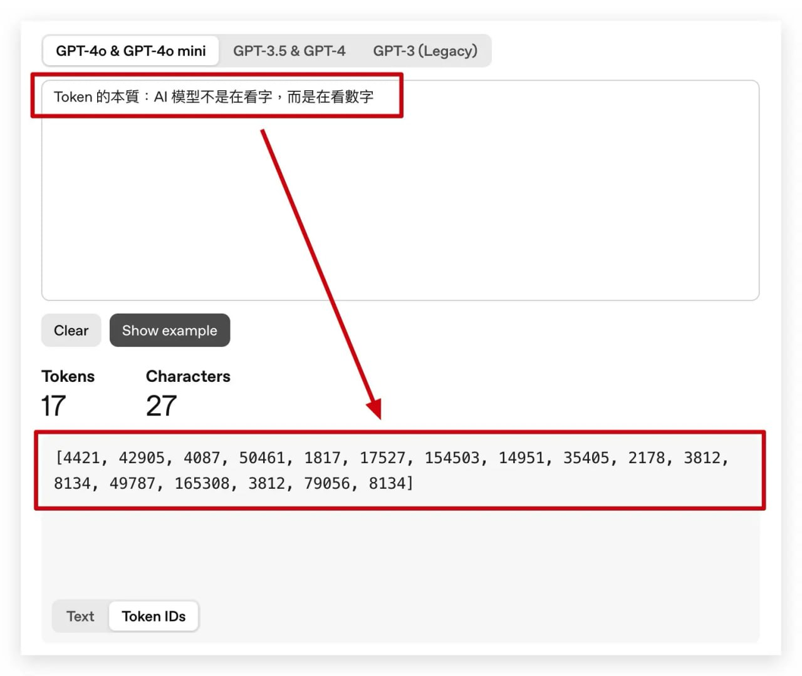
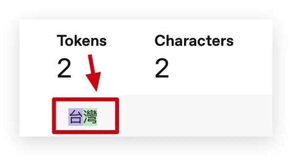
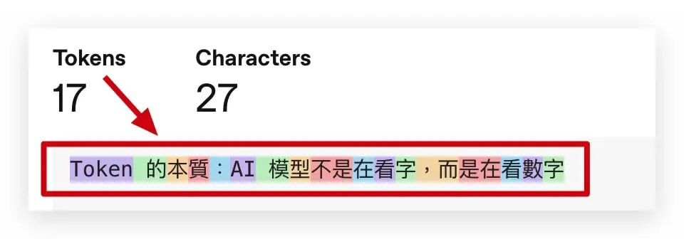
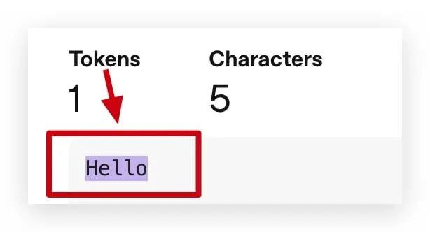
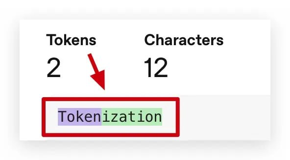
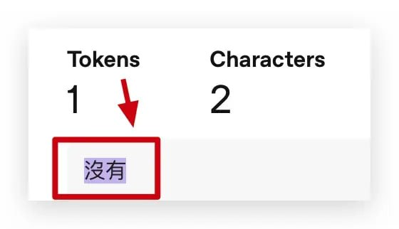

# Token 是什麼？AI 世界的最小單位

Token 是大型語言模型（LLM）處理文字時的最小單位，對一般人來說，它聽起來像是專業術語，但在我看來，這不過是「工程師讓機器懂人話」的一種手段，我從 80386 的年代一路走來，發現科技的本質其實沒變，一切都回到數字。

AI 模型在處理文字前，會先把字句轉成一連串的數字（Token ID）。上圖顯示「Token 的本質：AI 模型不是在看字，而是在看數字」共被切成 17 個 Token，每個 Token 以數字編碼表示。

AI 模型不會真正「讀懂」文字。

在 AI 的世界裡，所有的輸入都會被轉換成數字，這些數字代表特定的字、詞或符號。

每一個 Token 就像一顆積木，模型要做的事，就是不斷計算「積木的下一個積木應該是什麼」

舉例來說，當你輸入「今天心情不錯」，AI 實際在做的，是根據前面幾顆積木去「計算」下一顆最合理的 Token。

AI 的本質，它不是在「思考」，而是在「計算」，但當 AI 學習過的資料越多、計算出來的結果就好像在思考一樣

所以，當 AI 收到錯誤的資料，就會造成大量錯誤的資料產出，所以，AI 在學習的過程中沒有「乾淨」的資料，就會有「不乾淨」的回答。

每個顏色代表一個 Token。模型不是逐字讀取，而是以 Token 為單位進行理解與計算，這些區塊就是它在「看見」的內容。

## Token 怎麼切？靠分詞器（Tokenizer）

在模型運作前，所有文字都要先「切成小塊」，這個過程叫 Tokenization（分詞），而負責切的工具稱為 分詞器（Tokenizer），切得好不好，直接影響模型的效率與理解力。

### Token 的組成方式

- Token 的大小不固定，它可能是：

一個英文字母

- 一個中文字

- 一整個詞或片語

- 在英文裡，“Hello” 可能是一個 Token，但 “Tokenization” ，也可能被拆成 “Token” + “ization”。

- 在中文裡，「沒有」這類詞是一個 Token，但「台灣」通常是兩個 Token。

在英文中「Hello」通常是單一 Token，模型會將它整體視為一個語意單位處理。

較長的英文單字可能會被拆開，例如「Tokenization」被分成兩部分：「Token」與「ization」，這有助於模型處理詞根變化與詞形擴充。

中文的詞彙有時整組被視為一個 Token，例如「沒有」是一個常見詞，因此模型會把它當成單一語意單位處理。

並非所有中文詞都會被視為一個 Token。「台灣」在模型中被拆成兩個 Token，代表模型以較細的粒度理解組成字。

### 不同模型有不同切法

不同公司用的演算法不同。意思的指，雖然大家都在做「把文字切成 Token（分詞）」這件事，但每家公司設計 Tokenizer 的方式不同，所以切出來的結果也會不一樣。

舉個栗子，假設同一句話：「台灣很美」

#### Byte Pair Encoding

ChatGPT 使用的演算法叫 BPE（Byte Pair Encoding）→ 它會根據「哪些字常常一起出現」來學會合併。

OpenAI（ChatGPT） 的分詞器可能切成：[“台”, “灣”, “很”, “美”]（每個字都一個 Token）

#### SentencePiece

Google Gemini 使用 SentencePiece→ 它用機率方式學習「最可能的詞單位」，也能同時處理中、英文。

Google（Gemini） 的分詞器可能切成：[“台灣”, “很”, “美”]（「台灣」變成一個 Token）

這兩種切法都沒錯，只是演算法的規則不一樣。

### 為什麼要切？

因為模型的記憶容量有限，它能「記得」的內容是以 Token 數量計算的，如果切得太細，會浪費空間；切得太粗，又難理解語意。

最理想的分法，就像設計電路一樣，在效率與準確之間找到平衡。

## Token 與費用：每一個 Token 都算錢

在 AI 模型的世界裡，Token 不只是資料單位，更是計費單位。

### 常見的 Token 類別

- 輸入 Token（Input Tokens）：你輸入的內容。

- 輸出 Token（Output Tokens）：模型回覆給你的內容。

在商業版 API 或 ChatGPT Pro、Claude、Gemini 等服務中，你每打一個字、模型每回一句話，背後都在消耗 Token，這也就是為什麼每次執行 AI 指令，都會對應到使用成本。

### 進階模型中的其他 Token

- 快取 Token（Cached Tokens）：重複使用的對話內容，不重算費用。

- 推理 Token（Reasoning Tokens）：模型內部「思考步驟」時使用的額外 Token。

我覺得這很像 1970 年代的電路設計，那時要精算每個腳位、每顆電阻的功耗，今天的 AI 模型，也是一樣，只是我們算的是 Token。

## 為什麼要懂 Token？三個理由

如果你想更聰明地使用 AI 工具，理解 Token 是基本功，它能幫你控制成本、提升效率、甚至更深入理解模型運作邏輯。

- 控制成本：長篇 prompt、重複指令或冗長對話都會增加 Token 消耗。 想省錢，就學會寫短而精準的指令。

- 控制記憶：模型的記憶空間有限（例如 GPT-4o 支援 128K Token，大約 10 萬字），超過範圍就會被截斷，懂 Token，就能讓模型記住重點。

- 理解模型思考方式：一旦知道 AI 其實只是「計算出下一個 Token」， 你就不會把它神化，而會像我一樣去欣賞那背後的數學之美。

<!-- Removed -->

## 常見問題

### Token 到底是什麼？

Token 就像是 AI 理解文字的小積木。每一個字、詞或符號都會被變成一個 Token，然後轉成數字給 AI 看。因為 AI 不能直接看懂文字，只能靠數字去「算出」下一個最可能的詞。

### 不同公司為什麼切 Token 的方式不一樣？這會有差嗎？\n每家公司用的切法不一樣。像 ChatGPT 用一種方法（叫 BPE），會把常見的字組在一起，Google Gemini 用另一種方法（叫 SentencePiece），用機率去計算哪些詞應該合在一起。結果可能不同，但意思都對，不會影響理解。

### Token 和模型的記憶有什麼關係？

AI 的記憶容量是用 Token 算的，不是字數。像 GPT-4 可以處理 128K Token，大約等於 10 萬字。如果超過這個量，前面的內容就會被忘記，所以懂 Token 能幫你控制對話長度。

### Token 會花錢嗎？怎麼算？

會。你輸入的每個字（輸入 Token）和 AI 回覆的每句話（輸出 Token）都要算錢。有些還有推理 Token（AI 思考時用的）或快取 Token（重複內容不重算）。懂這些就能知道為什麼有時候用 AI 費用會變高。

### 為什麼一般人也要懂 Token？

因為懂 Token 可以幫你：
省錢：少打廢話、減少重複內容。
提升效果：讓 AI 聚焦在重要資訊上。
看清本質：知道 AI 不是在「思考」，而是在根據前面的 Token 去算下一個。懂這點，你就能更聰明地用 AI。

<!-- Removed -->
